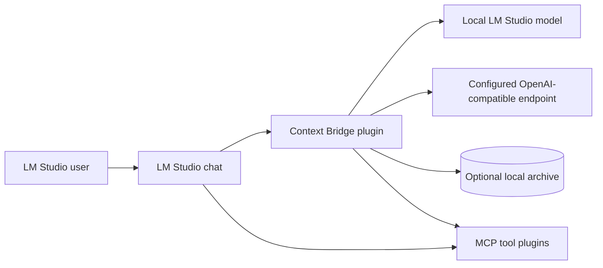

# System context

LM Studio and the local filesystem are trusted local boundaries. The configured external endpoint
is a separate network trust boundary. Only prompts, tool definitions/results, and generation
parameters required by the selected external path cross it.
